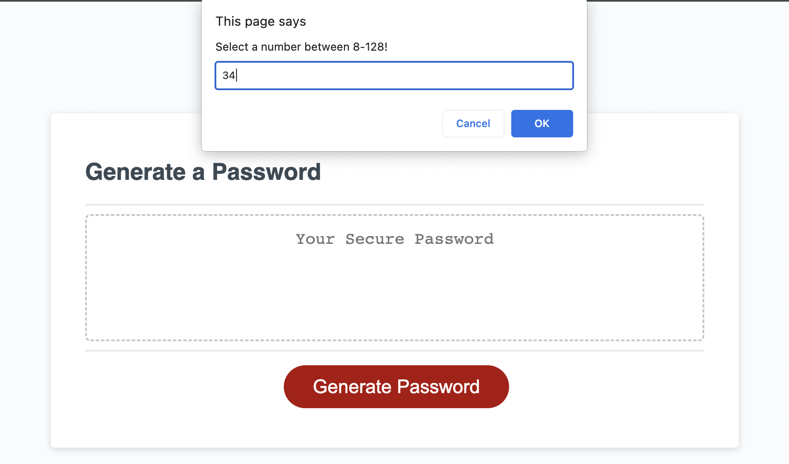

# Password Generator Starter Code

## Description
    This password generator was created as a Javascript practice challenge to make a complex random generator and display it on the screen for the user to use.

## Usage
    Within this generator the user can select 5 things to include in their password. First how long they want it (8-128 characters), second if they want to include numbers. Third, if they want lower case letters and upper case letters. Lastely if they want to include special characters.

## Screenshots
   

## Features
    -Select Length.
    -Select Numbers.
    -Select Letters(Upper and Lower).
    -Select Special characters.

## License
    MIT License